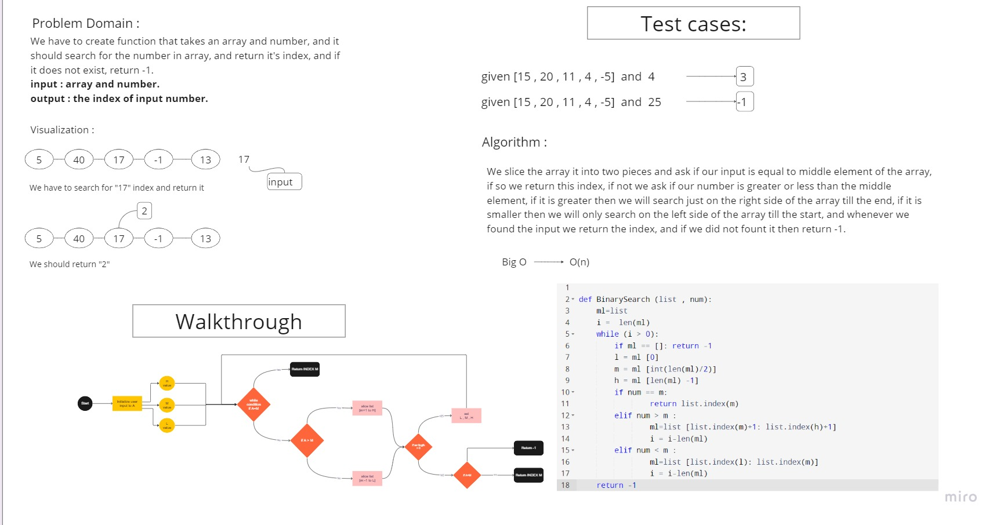
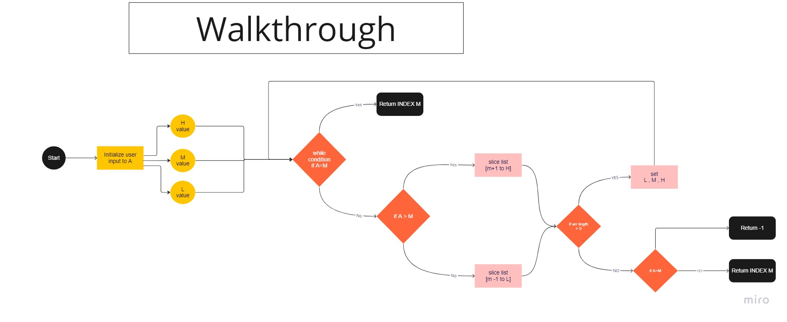

# Binary-search-in-a-sorted-1D-array

We have to create a function that called BinarySearch which takes in 2 parameters: a sorted array and the search key. Without utilizing any of the built-in methods available to your language, return the index of the array’s element that is equal to the value of the search key, or -1 if the element is not in the array. using the binary search algorithm

## Whiteboard Process



## Approach & Efficiency
We slice the array it into two pieces and ask if our input is equal to middle element of the array, if so we return this index, if not we ask if our number is greater or less than the middle element, if it is greater then we will search just on the right side of the array till the end, if it is smaller then we will only search on the left side of the array till the start, and whenever we found the input we return the index, and if we did not fount it then return -1.

## Solution
Here is the code and it passes all the tests.

```
def BinarySearch (list , num):
    ml=list 
    i =  len(ml)
    while (i > 0):
        if ml == []: return -1
        l = ml [0]
        m = ml [int(len(ml)/2)]
        h = ml [len(ml) -1]
        if num == m:
                return list.index(m)
        elif num > m :
                ml=list [list.index(m)+1: list.index(h)+1]
                i = i-len(ml)
        elif num < m :
                ml=list [list.index(l): list.index(m)]
                i = i-len(ml)
    return -1
```
### done by :
- Mones saeed (navigator) 
- Ibraheem areeda (driver)
