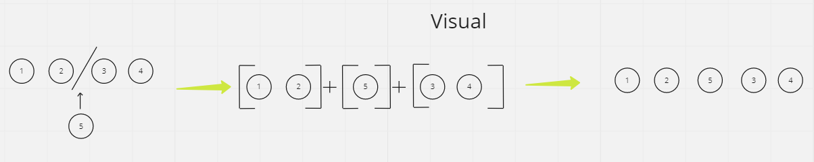
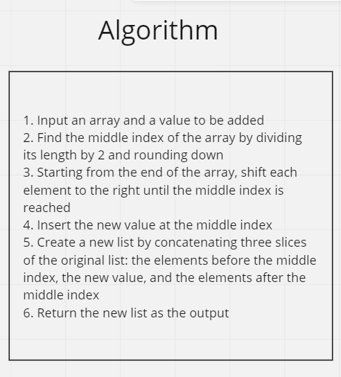
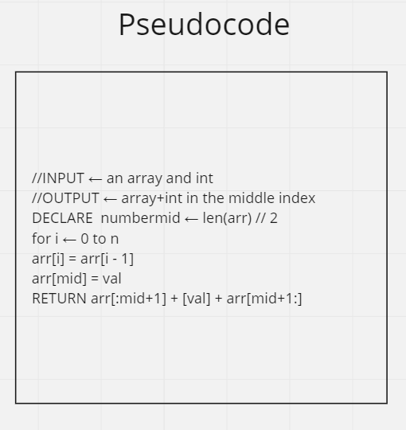
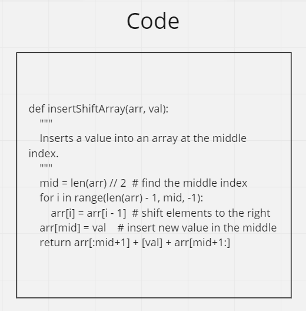
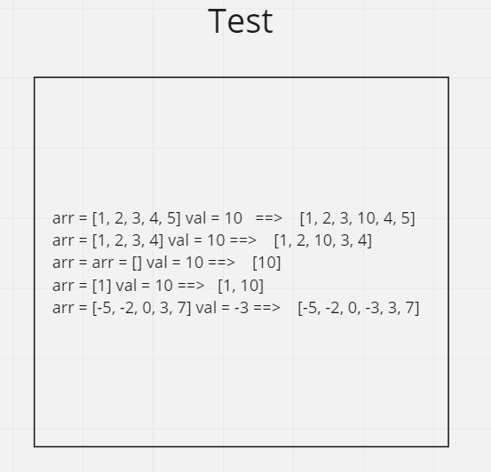
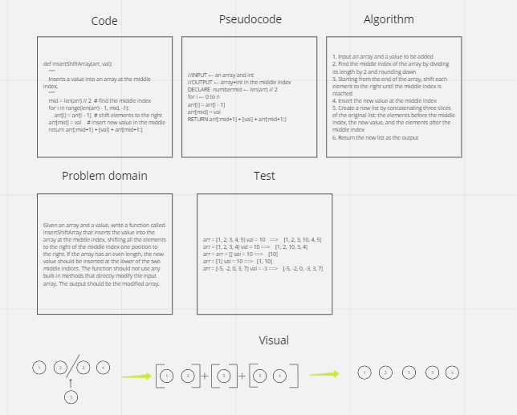

# array-insert-shift
I will write a function called insertShiftArray which takes in an array and a value to be added. Without utilizing any of the built-in methods available to python, return an array with the new value added at the middle index.

## Whiteboard Process

## Approach & Efficiency
What approach did you take? 
This implementation creates a new list by concatenating three slices of the original list: the elements before the middle index (arr[:mid]), the new value ([val]), and the elements after the middle index (arr[mid+1:]).

## Solution

def insertShiftArray(arr, val):  
    """
    Inserts a value into an array at the middle index.
    """  
    mid = len(arr) // 2  # find the middle index
    
    return arr[:mid] + [val] + arr[mid:]
