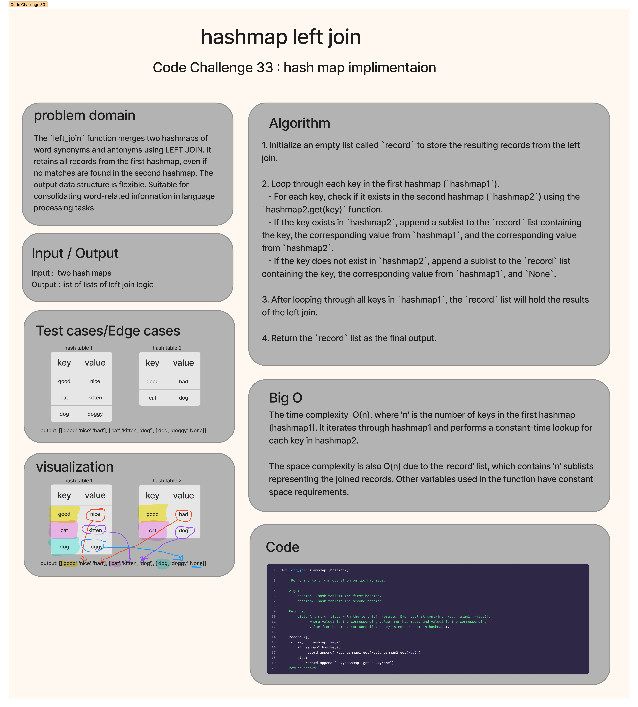

# Code Challenge: Class 33 hashmap-left-join
The function "left_join" merges two hashmaps containing word synonyms and antonyms into a single data structure using a LEFT JOIN logic. It combines the information based on common keys (word strings) and retains all records from the first hashmap, even if no matching key is found in the second hashmap. The specific data structure used for the output is flexible and can be tailored to the application's needs. This function facilitates the consolidation of word-related information, such as synonyms and antonyms, for various language processing and analysis tasks.
## Whiteboard Process

## Approach & Efficiency
The time complexity of the left_join function is O(n), where 'n' is the number of keys in the first hashmap (hashmap1). It iterates through hashmap1 and performs a constant-time lookup for each key in hashmap2.

The space complexity of the function is also O(n) due to the 'record' list, which contains 'n' sublists representing the joined records. Other variables used in the function have constant space requirements.
## Solution
'''
def left_join (hashmap1,hashmap2):
    '''
     Perform a left join operation on two hashmaps.

    Args:
        hashmap1 (hash table): The first hashmap.
        hashmap2 (hash table): The second hashmap.

    Returns:
        list: A list of lists with the left join results. Each sublist contains [key, value1, value2],
              where value1 is the corresponding value from hashmap1, and value2 is the corresponding
              value from hashmap2 (or None if the key is not present in hashmap2).
    '''
    record =[]
    for key in hashmap1.keys:
        if hashmap2.has(key):
            record.append([key,hashmap1.get(key),hashmap2.get(key)])
        else:
            record.append([key,hashmap1.get(key),None])
    return record

'''