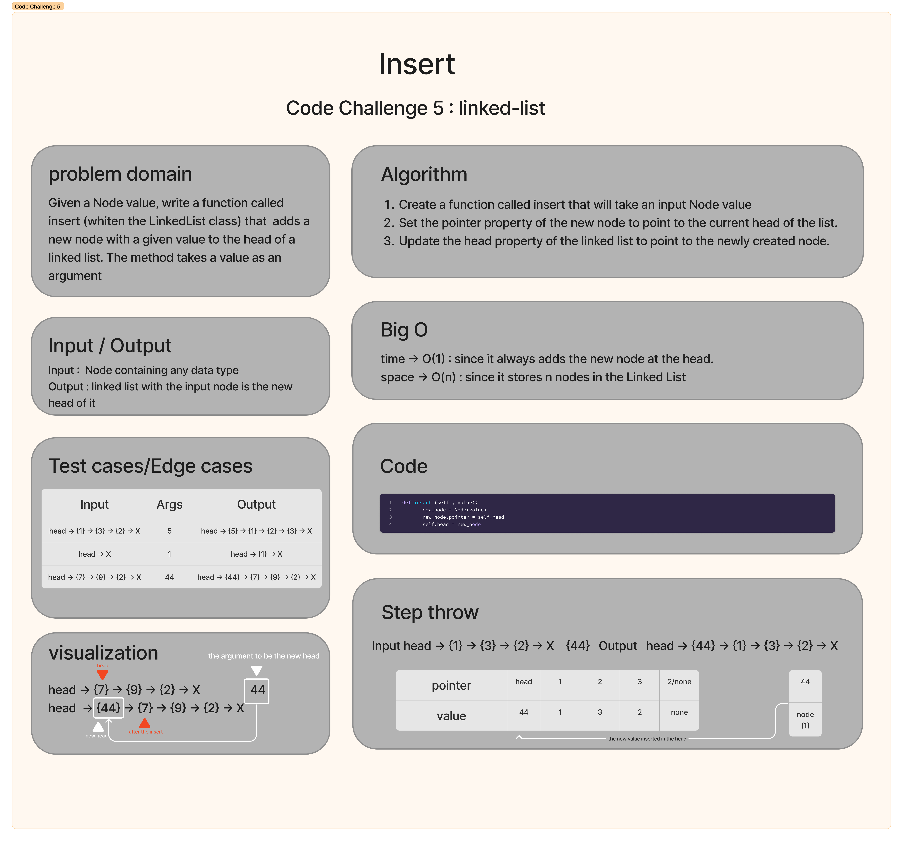

# Code Challenge: Class 05: Linked List 
This challenge involves implementing a Linked List data structure with a Node class and a Linked List class. The Node class represents individual nodes with a value and a pointer to the next node. The Linked List class has a head property and provides methods for inserting a new node at the head, checking if a value exists in the list, and converting the list to a string representation.

## Whiteboard Process


## Approach & Efficiency
The approach  is to implement a Linked List using two classes: `Node` and `LinkedList`. 

The `Node` class represents each individual node in the Linked List. Each node has a `value` property to store the value it holds and a `pointer` property that points to the next node in the list. This class also defines a `__repr__` method for better representation when printing Node instances.

The `LinkedList` class represents the overall Linked List structure. It has a `head` property that points to the first node in the list. The class provides the following methods:

1. `insert`: Inserts a new node with a given value at the head of the list. This method has a time complexity of O(1) since it always adds the new node at the head.
2. `includes`: Checks if a given value exists as a node's value somewhere within the list. It iterates through the list until it finds the value or reaches the end. The time complexity of this method is O(n), where n is the number of nodes in the list.
3. `to_string`: Converts the Linked List into a string representation. It traverses the list, collects the values, and formats them into a string with the desired formatting. The time complexity of this method is also O(n) since it traverses each node in the list.

Overall, the code has a space complexity of O(n) since it stores n nodes in the Linked List. The time complexity for most operations is O(n) because they involve traversing the list from the head to the last node. The `insert` operation, however, has a time complexity of O(1) since it always adds the new node at the head without traversing the entire list.


## Solution
```
class Node ():
    def __init__(self, value ,next_node = None):
        self.value = value
        self.pointer = next_node

    def __repr__ (self):
        return f"Node instance. value = {self.value} pointer = {self.pointer}"


class LinkedList ():
    def __init__(self,head=None):
        self.head = head
    
    def __repr__ (self):
        return f"LinkedList instance. head = {self.head}"

    def insert (self , value):
        new_node = Node(value)
        new_node.pointer = self.head
        self.head = new_node

    def includes(self,value) :
        current = self.head
        while current:
            if current.value == value: return True
            current = current.pointer
        return False
    
    def to_string (self) :
    
        def formater (lst):
            formatted_values = []
            for value in lst:
                formatted_value = '{ ' + value + ' }'
                formatted_values.append(formatted_value)
                formatted_string = ' -> '.join(formatted_values)
            return formatted_string + ' -> NULL'
    
        lst = []
        current = self.head
        while current:
            lst.append(str(current.value))
            current = current.pointer
        
        return formater(lst)
```

# Code Challenge: Class 05: Linked List 
This challenge involves implementing a Linked List data structure with a Node class and a Linked List class. The Node class represents individual nodes with a value and a pointer to the next node. The Linked List class has a head property and provides methods for inserting a new node at the head, checking if a value exists in the list, and converting the list to a string representation.

## Whiteboard Process


## Approach & Efficiency
The approach  is to implement a Linked List using two classes: `Node` and `LinkedList`. 

The `Node` class represents each individual node in the Linked List. Each node has a `value` property to store the value it holds and a `pointer` property that points to the next node in the list. This class also defines a `__repr__` method for better representation when printing Node instances.

The `LinkedList` class represents the overall Linked List structure. It has a `head` property that points to the first node in the list. The class provides the following methods:

1. `insert`: Inserts a new node with a given value at the head of the list. This method has a time complexity of O(1) since it always adds the new node at the head.
2. `includes`: Checks if a given value exists as a node's value somewhere within the list. It iterates through the list until it finds the value or reaches the end. The time complexity of this method is O(n), where n is the number of nodes in the list.
3. `to_string`: Converts the Linked List into a string representation. It traverses the list, collects the values, and formats them into a string with the desired formatting. The time complexity of this method is also O(n) since it traverses each node in the list.

Overall, the code has a space complexity of O(n) since it stores n nodes in the Linked List. The time complexity for most operations is O(n) because they involve traversing the list from the head to the last node. The `insert` operation, however, has a time complexity of O(1) since it always adds the new node at the head without traversing the entire list.


## Solution
```
class Node ():
    def __init__(self, value ,next_node = None):
        self.value = value
        self.pointer = next_node

    def __repr__ (self):
        return f"Node instance. value = {self.value} pointer = {self.pointer}"


class LinkedList ():
    def __init__(self,head=None):
        self.head = head
    
    def __repr__ (self):
        return f"LinkedList instance. head = {self.head}"

    def insert (self , value):
        new_node = Node(value)
        new_node.pointer = self.head
        self.head = new_node

    def includes(self,value) :
        current = self.head
        while current:
            if current.value == value: return True
            current = current.pointer
        return False
    
    def to_string (self) :
    
        def formater (lst):
            formatted_values = []
            for value in lst:
                formatted_value = '{ ' + value + ' }'
                formatted_values.append(formatted_value)
                formatted_string = ' -> '.join(formatted_values)
            return formatted_string + ' -> NULL'
    
        lst = []
        current = self.head
        while current:
            lst.append(str(current.value))
            current = current.pointer
        
        return formater(lst)
```

