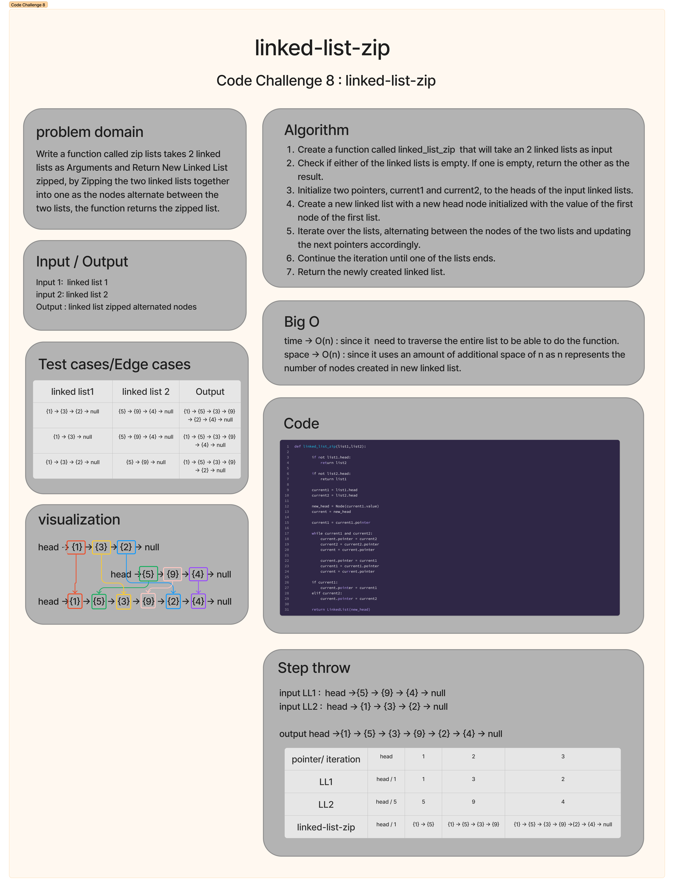

# linked-list-zip
Write a function called zip lists takes 2 linked lists as Arguments and Return New Linked List zipped, by Zipping the two linked lists together into one as the nodes alternate between the two lists, the function returns the zipped list.

## Whiteboard Process


## Approach & Efficiency
The zip_lists function follows a straightforward approach to zip two linked lists together. It starts by checking if either of the linked lists is empty. If one list is empty, the function returns the other list as the result, as there is no need to perform any zipping in that case.
Next, it initializes two pointers, current1 and current2, to the heads of the first and second linked lists, respectively. These pointers will be used to traverse the lists.
The function then creates a new linked list by creating a new head node, new_head, and initializes it with the value of the first node of the first linked list (current1).
To zip the lists together, the function iterates over the lists, alternating between the nodes of the two lists. It updates the next pointers of the nodes to link them together appropriately.
The iteration continues until one of the lists ends, which is determined by either current1 or current2 becoming None. At that point, the function breaks out of the loop.
Finally, the function returns the newly created linked list by returning LinkedList(new_head)

The space complexity of this approach is O(n) since it uses an amount of additional space of n as n represents the number of nodes created in new linked list.

The time complexity of the zip_lists function is O(n), where n is the total number of nodes in the longer linked list. This is because the function iterates over the linked lists once, visiting each node exactly once. The length of the shorter list does not affect the overall time complexity.

## Solution
```
def linked_list_zip(list1,list2):
            
        if not list1.head:
            return list2
        
        if not list2.head:
            return list1

        current1 = list1.head
        current2 = list2.head

        new_head = Node(current1.value)
        current = new_head

        current1 = current1.pointer

        while current1 and current2:
            current.pointer = current2
            current2 = current2.pointer
            current = current.pointer

            current.pointer = current1
            current1 = current1.pointer
            current = current.pointer

        if current1:
            current.pointer = current1
        elif current2:
            current.pointer = current2

        return LinkedList(new_head)
```


