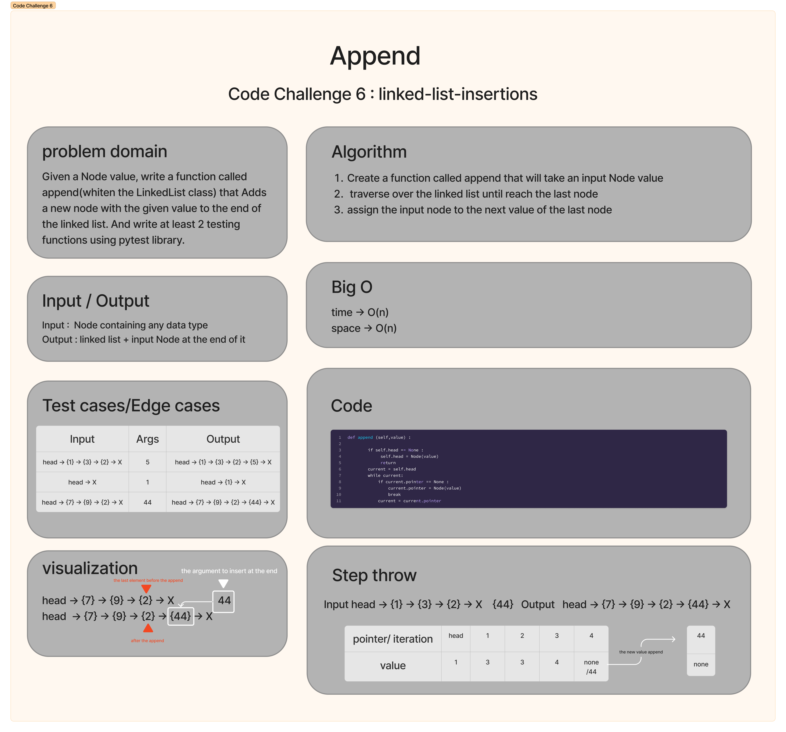

# Code Challenge 6 : linked-list-insertions

The challenge want us to implement the following methods for the Linked List class we did at the last challenge:

1. `append(new_value)`: Adds a new node with the given value to the end of the list.

2. `insert_before(value, new_value)`: Adds a new node with the given new value immediately before the first node that has the specified value.

3. `insert_after(value, new_value)`: Adds a new node with the given new value immediately after the first node that has the specified value.


## Whiteboard Process
Here I will attach the pictures of the 3 whiteboards I did for the 3 methods in the past description
- Append 


- Insert Befor 


- Insert After


## Approach & Efficiency
My approach was to simplfy the problem and to solved like baby steps, using "TDD" test driven development I went btween the tests and the code back and forth, basically I wrote the test then I wrote the algorithm
then I implemented it by coding, for this challange I didnt need to use google at all, I solved it by my self, finally I was concerned about the space and time complexity, so as you know working on linked lists results a O(n) and that what I got here, it always looping because we dont have index for our values.   

## Solution
```
class Node ():
    def __init__(self, value ,next_node = None):
        self.value = value
        self.pointer = next_node

    def __repr__ (self):
        return f"Node instance. value = {self.value} pointer = {self.pointer}"


class LinkedList ():
    def __init__(self,head=None):
        self.head = head
    
    def __repr__ (self):
        return f"LinkedList instance. head = {self.head}"

    def insert (self,value):
        new_node = Node(value)
        new_node.pointer = self.head
        self.head = new_node

    def includes(self,value) :
        current = self.head
        while current:
            if current.value == value: return True
            current = current.pointer
        return False

    def to_string (self) :
    
        def formater (lst):
            formatted_values = []
            for value in lst:
                formatted_value = '{ ' + value + ' }'
                formatted_values.append(formatted_value)
                formatted_string = ' -> '.join(formatted_values)
            return formatted_string + ' -> NULL'
        lst = []
        current = self.head
        while current:
            lst.append(str(current.value))
            current = current.pointer
        return formater(lst)
    
    def append (self,value) :

        if self.head == None :
             self.head = Node(value)
             return
        current = self.head
        while current:
            if current.pointer == None :
                current.pointer = Node(value)
                break
            current = current.pointer

    def insert_before(self,value,new_value):
        current = self.head
        previous = self.head
        count = 0
        if self.head.value == value : 
            self.head = Node(new_value,self.head.pointer)
            return
        while current:
            if current.value == Node(value).value:
                previous.pointer = Node(new_value,current)
            if count >= 1: 
                previous = previous.pointer
            current = current.pointer
            count = count + 1

    def insert_after(self,value,new_value):
        current = self.head
        while current:
            if current.value == value:
                current.pointer = Node(new_value,current.pointer)
                return
            else: current = current.pointer
        

if __name__=="__main__":

    
    node_4=Node (4)
    node_3=Node (3,node_4)
    node_2=Node (2,node_3)
    node_1=Node (1,node_2)
    
    linked_ltest = LinkedList (node_1)
    
    linked_ltest.insert_after(4,88)

    print(111111,linked_ltest)
```

