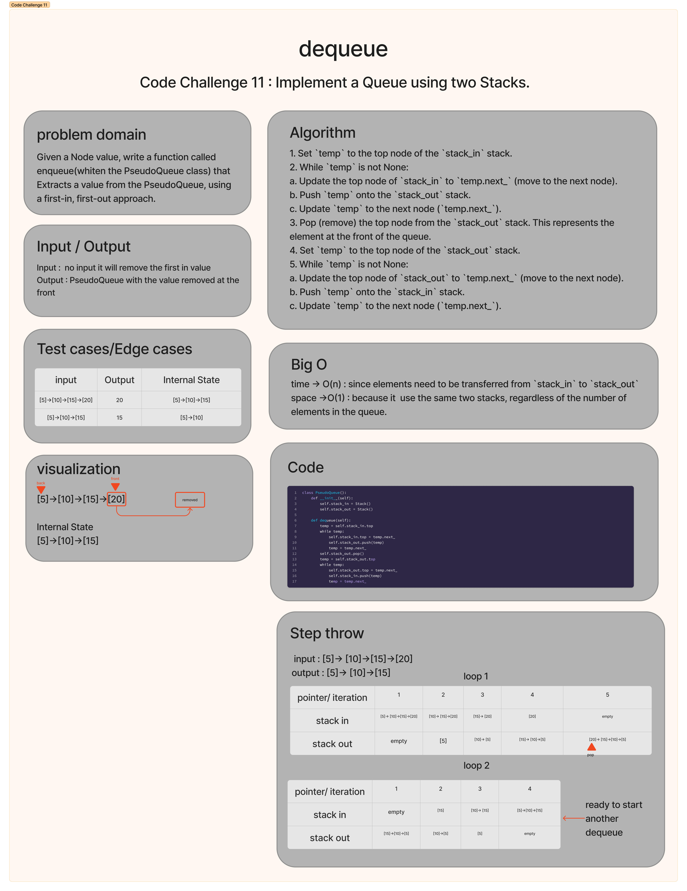
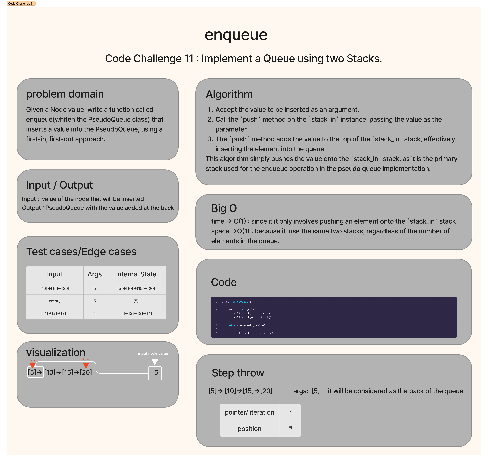

# Stack Queue Pseudo
The task is to implement `PseudoQueue` class which is a custom queue implementation using two stacks. It follows the first-in, first-out (FIFO) approach. The class provides methods to enqueue and dequeue elements. Enqueue inserts values at the end of the queue, while dequeue removes and returns the first added value.

## Whiteboard Process


## Approach & Efficiency
The code implements a pseudo queue using two stacks. The `enqueue` method inserts elements into the queue, and the `dequeue` method removes and returns the element from the front of the queue.

Approach:
1. For the `enqueue` operation, elements are pushed onto the `stack_in` stack. This operation has a time complexity of O(1) as it directly pushes the element onto the stack.
2. For the `dequeue` operation, the elements are transferred from the `stack_in` stack to the `stack_out` stack. This is done by popping elements from `stack_in` and pushing them onto `stack_out`. This step ensures that the order of elements is reversed in `stack_out`, simulating the behavior of a queue.
3. Once the elements are transferred to `stack_out`, the top element is popped, which represents the front element of the queue. This operation has a time complexity of O(1) as it directly pops the front element from the stack_out.

Efficiency:
1. The `enqueue` operation has a time complexity of **O(1)** as it only involves pushing an element onto the `stack_in` stack.
2. The `dequeue` operation has an average time complexity of **O(n)**, where n is the number of elements in the queue. This is because, in the worst case, all elements need to be transferred from `stack_in` to `stack_out`. However, subsequent `dequeue` operations will have an average time complexity of **O(1)** until the `stack_out` stack becomes empty and needs to be refilled from `stack_in`.
3. Both the `enqueue` and `dequeue` operations have a space complexity of O(1) as they use the same two stacks, regardless of the number of elements in the queue.


## Solution

```
class PseudoQueue():
    """
    PseudoQueue represents a queue implemented using two stacks.

    The class provides methods to enqueue and dequeue elements from the queue.

    Attributes:
    - stack_in (Stack): Stack used for enqueue operation.
    - stack_out (Stack): Stack used for dequeue operation.

    Methods:
    - enqueue(value): Inserts an element into the queue.
    - dequeue(): Removes and returns the element from the front of the queue.
    """
    def __init__(self):
        self.stack_in = Stack()
        self.stack_out = Stack()

    def enqueue(self, value):
        """
        Inserts an element into the queue.

        Args:
        - value: The value to be inserted.
        """
        self.stack_in.push(value)

    def dequeue(self):
        """
        Removes and returns the element from the front of the queue.

        Returns:
        - The element at the front of the queue.

        Raises:
        - Exception : If the queue is empty.
        """
        temp = self.stack_in.top
        while temp:
            self.stack_in.top = temp.next_
            self.stack_out.push(temp)
            temp = temp.next_
        self.stack_out.pop()
        temp = self.stack_out.top
        while temp:
            self.stack_out.top = temp.next_
            self.stack_in.push(temp)
            temp = temp.next_

```


